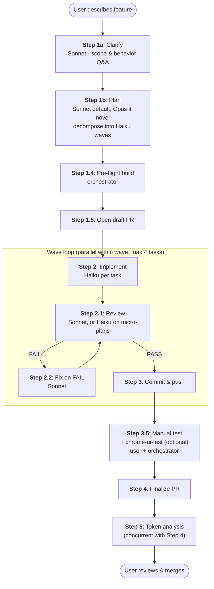
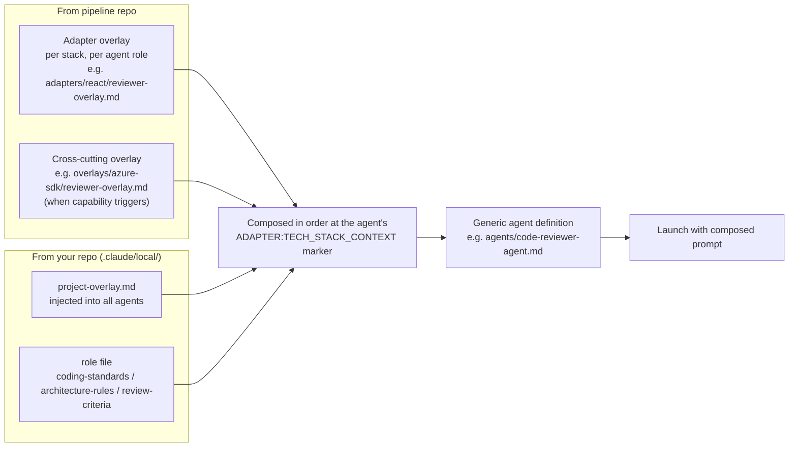
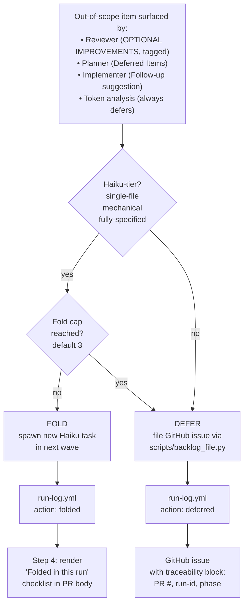

# Claude Code Pipeline

A general-purpose, tech-stack-agnostic orchestration pipeline for [Claude Code](https://docs.anthropic.com/en/docs/claude-code). Coordinates planning, implementation, code review, testing, and git workflow through specialized agents — across any language or framework.

## Why This Exists

Claude Code is powerful, but complex multi-file features benefit from structured coordination. Without it, you get:
- Implementations that drift from requirements
- Code that ships without review
- Regressions that slip through because tests weren't run
- Commits with inconsistent messages and no traceability

This pipeline enforces a disciplined workflow: **clarify -> plan -> implement -> review -> test -> commit -> manual verify -> finalize -> analyze token usage**. Every step is handled by a specialized agent with the right model (Haiku for mechanical tasks, Sonnet for judgment, Opus for architecture) — optimizing both quality and cost.

The pipeline is **tech-stack-agnostic**. The core workflow is identical whether you're building a Swift/iOS app, a React frontend, or a Python API. Stack-specific knowledge (build commands, code review rules, testing patterns) lives in **adapters** that get injected at runtime.

## Pipeline Flow

```
User: "Add feature X" or /orchestrate
    |
    v
Step 1a: FEATURE CLARIFICATION ──────────── architect-agent (Sonnet)
    |  Feature decomposition along product seams
    |  Fragile area scan against ORCHESTRATOR.md
    |  Feature-only Q&A: scope, behavior, business rules
    |    Soft-cap 2 SendMessage rounds; hard-cap 150K cumulative tokens
    |    User can type FINALIZE NOW to force closure
    |  NO technical/architecture questions — deferred to 1b
    |  Output: .claude/tmp/1a-spec.md (enriched spec)
    v
Step 1b: IMPL CLARIFICATION & PLAN ────── architect-agent (Sonnet default / Opus, fresh context)
    |  Reads enriched spec + 1b Extract from ORCHESTRATOR.md (~12K tokens clean)
    |  Phase 1: Implementation Q&A after codebase analysis (max 2 rounds)
    |    Architecture approach, patterns, integration, data modeling, tradeoffs
    |  Phase 2: Cost-optimized decomposition: >=70% Haiku tasks
    |  Self-contained context briefs per task
    |  Parallel waves with dependency ordering (cap 4 tasks per wave)
    |  Output: .claude/tmp/1b-plan.md (recovery artifact)
    |  User confirms plan before proceeding
    v
Step 1.4: PRE-FLIGHT BUILD VERIFICATION ── orchestrator
    |  Run adapter build script on the unmodified base before launching Haiku
    |  PASS  -> proceed to Step 1.5
    |  FAIL  -> pause; ask user: abort | continue anyway | inject Wave 0 fix
    |    Prevents Haiku failures from pre-existing build blockers
    v
Step 1.5: OPEN PR ────────────────────────── orchestrator
    |  Create feature branch from main
    |  Open draft PR with plan summary + task checklist
    v
Step 2: IMPLEMENT ────────────────────────── implementer-agent (Haiku/Sonnet/Opus)
    |  One agent per task, parallel within waves (cap 4)
    |  Each: implement -> self-review -> build -> test (>=90% coverage)
    |  Output: SUCCESS + commit message  OR  FAILURE + details
    v
Step 2.1: REVIEW ─────────────────────────── code-reviewer-agent (Sonnet, or Haiku on micro-plans)
    |  Aggressive review: memory leaks, race conditions, security, architecture
    |  Cost-proportional reviewer (M3): single-wave plans with all briefs <3KB
    |    use Haiku first-pass; Sonnet escalation on any FAIL
    |  Reviewer reuse via SendMessage (cap 8 reviews per agent)
    |  Output: PASS  OR  FAIL + structured issues list
    |          + OPTIONAL IMPROVEMENTS tagged [should-fix] / [nice-to-have] / [simplify]
    |            (combined cap 5 entries; orchestrator folds or defers per backlog rules)
    v
Step 2.2: FIX (if FAIL) ─────────────────── implementer-agent (Sonnet, escalated)
    |  Fix reviewer findings, re-build, re-test
    |  Max 2 review-fix cycles, then escalate to user
    v
Step 3: COMMIT + PUSH ───────────────────── orchestrator
    |  Commit per task with implementer's message verbatim
    |  Push after each commit (progress visible on draft PR)
    |  Record test baseline (total passing count)
    v
Step 3.5: MANUAL TEST + BROWSER UI ──────── user + orchestrator + chrome-ui-test (optional)
    |  Optional automated browser smoke via the chrome-ui-test skill (React UIs)
    |    Failures route into the same fix loop as user-reported bugs
    |  User tests the PR branch, reports bugs
    |  Each bug: assess blast radius -> fix -> review -> commit
    |  Regression guard: test count must never decrease
    |  Max 3 fix cycles per round, then escalate
    v
Step 4: FINALIZE ─────────────────────────── orchestrator
    |  Update ORCHESTRATOR.md if architecture changed
    |  Update PR body with coverage numbers
    |  Mark PR ready for review
    |  Report: PR URL, tasks completed, coverage summary
    v
Step 5: TOKEN ANALYSIS ──────────────────── token-analysis skill (mandatory)
    |  Analyze TOKEN_LEDGER: cost, model distribution, prompt efficiency
    |  File GitHub issue on pipeline repo if significant findings
    v
User merges when ready (pipeline never auto-merges)
```

### Pipeline at a Glance



**Reading the diagram:** rectangular nodes are pipeline steps; the *Wave loop* subgraph executes once per dependency wave (typically 1–3 waves per feature). Steps 1a/1b are blocking on user approval; Step 3.5 is blocking on user manual testing. Step 5 runs in parallel with Step 4 to overlap analysis with PR finalization.

## Quick Start

### 1. Clone the pipeline into your project

```bash
cd your-project
git clone https://github.com/MILL5/claude-code-pipeline.git .claude/pipeline
```

Or add as a git submodule for version-pinned updates:

```bash
git submodule add https://github.com/MILL5/claude-code-pipeline.git .claude/pipeline
```

### 2. Bootstrap

```bash
# Auto-detect your tech stack
bash .claude/pipeline/init.sh .

# Or specify explicitly (supports multiple --stack flags for multi-stack repos)
bash .claude/pipeline/init.sh . --stack=swift-ios
bash .claude/pipeline/init.sh . --stack=react
bash .claude/pipeline/init.sh . --stack=python
bash .claude/pipeline/init.sh . --stack=bicep
bash .claude/pipeline/init.sh . --stack=flutter
bash .claude/pipeline/init.sh . --stack=android
bash .claude/pipeline/init.sh . --stack=react --stack=python --stack=bicep

# Flutter multi-stack (shared Dart + native platform code)
bash .claude/pipeline/init.sh . --stack=flutter --stack=swift-ios --stack=android
```

The init script:
1. Detects all applicable tech stacks from project files (Package.swift, package.json, pyproject.toml, *.bicep, pubspec.yaml, build.gradle.kts, etc.)
   - Also detects Azure SDK usage in dependencies and activates the `azure-sdk` overlay automatically
   - For multi-stack repos, all detected stacks are activated with auto-generated `stack_paths` mappings
2. Creates symlinks: `.claude/agents/` -> pipeline agents, `.claude/skills/` -> pipeline skills, `.claude/scripts/<stack>/` -> adapter scripts (one per stack)
3. Writes `.claude/pipeline.config` with stacks, stack_paths, pipeline_version, and pipeline path
4. Merges adapter hooks from all active adapters into `.claude/settings.json`
5. Generates `.claude/CLAUDE.md` and `.claude/ORCHESTRATOR.md` from templates (if they don't exist)
6. Creates `.claude/local/` with project-specific overlay templates (if they don't exist)

### 3. Configure your project

Edit the generated files:

- **`.claude/CLAUDE.md`** — Set your developer persona, project description, and any project-specific workflow rules
- **`.claude/ORCHESTRATOR.md`** — Document your architecture, services, directory structure, conventions, fragile areas, and current build/test status
- **`.claude/local/`** — Add project-specific standards that get injected into agents:
  - `project-overlay.md` — Rules for all agents (e.g., "use trunk-based dev, PRs under 400 lines")
  - `coding-standards.md` — Rules for implementer + reviewer (e.g., "use zod for validation")
  - `architecture-rules.md` — Rules for architect (e.g., "all DB access through repository layer")
  - `review-criteria.md` — Rules for reviewer (e.g., "check for N+1 queries on all endpoints")

These are your project's living documentation. The pipeline reads them before every operation.

### 4. Run the pipeline

Start Claude Code in your project directory:

```bash
claude
```

Then use any of these to trigger the pipeline:

- `/orchestrate` — Full pipeline run
- "implement X" / "add feature X" / "fix bug Y" — Auto-triggers orchestration
- "build" / "implement" / "add feature" — Also triggers

## Available Adapters

| Adapter | Auto-Detects | Build Tool | Test Framework | Coverage |
|---------|-------------|------------|----------------|----------|
| `swift-ios` | `*.xcodeproj`, `*.xcworkspace`, `Package.swift` | Xcode / Swift PM | XCTest | xccov |
| `react` | `package.json` with `react` dependency | npm/yarn/pnpm/bun + tsc | Jest / Vitest | istanbul / v8 |
| `python` | `pyproject.toml`, `setup.py`, `requirements.txt` | mypy + ruff | pytest | pytest-cov |
| `flutter` | `pubspec.yaml` with `flutter:` | flutter analyze + dart format | flutter test (unit/widget/golden/integration) | lcov |
| `android` | `build.gradle.kts`, `build.gradle` | Gradle (AGP) + Android lint | JUnit 4 + Robolectric / Espresso / Compose Testing | JaCoCo |
| `bicep` | `*.bicep`, `bicepconfig.json` | bicep build + az bicep lint | ARM-TTK / PSRule / what-if | Resource validation coverage |

**Deploying to Azure?** See the **[Azure Deployment Guide](docs/azure-guide.md)** for Bicep adapter setup, Azure SDK overlay, authentication, and the 7 Azure-specific skills.

### What Each Adapter Provides

Every adapter includes 10 files:

| File | Purpose |
|------|---------|
| `manifest.json` | Machine-readable descriptor: detection rules, stack_paths, capabilities, implied overlays |
| `adapter.md` | Stack metadata: name, languages, build/test commands, blocked commands, conventions |
| `architect-overlay.md` | Framework-specific complexity patterns for task decomposition and model assignment |
| `implementer-overlay.md` | Language-specific code quality rules injected into the implementer agent (full version) |
| `implementer-overlay-essential.md` | Compact rules-only variant (~500-800 chars) used for Haiku tasks to maximize signal-to-noise ratio |
| `reviewer-overlay.md` | Stack-specific code review checklist (8 categories per adapter) |
| `test-overlay.md` | Testing framework patterns, assertion conventions, mocking strategies |
| `hooks.json` | PreToolUse hooks that block raw build/test commands (forces pipeline skill usage) |
| `scripts/build.py` | Build runner matching the pipeline's output contract |
| `scripts/test.py` | Test runner matching the pipeline's output contract |

## Architecture

### Agents

The pipeline uses 4 specialized agents, each with a focused role:

| Agent | Default Model | Role |
|-------|--------------|------|
| `architect-agent` | Sonnet (1a), Sonnet/Opus (1b) | Feature clarification (1a) and implementation Q&A + plan generation (1b) |
| `implementer-agent` | Haiku | Executes individual tasks from context briefs. Escalates to Sonnet for fixes. |
| `code-reviewer-agent` | Sonnet | Aggressive code review with PASS/FAIL protocol |
| `test-architect-agent` | Haiku | Generates comprehensive test suites for coverage gaps |

Agents are **generic** — they contain no tech-stack-specific knowledge. Stack context is injected by the orchestrator at launch time via overlay markers (`<!-- ADAPTER:TECH_STACK_CONTEXT -->`).

### Skills

| Skill | Trigger | Purpose |
|-------|---------|---------|
| `orchestrate` | `/orchestrate`, "implement", "add feature", "fix bug" | Master pipeline coordinator |
| `architect-analyzer` | Step 1a (via orchestrator) | Feature-only clarification (scope, behavior, business rules) and enriched spec generation |
| `architect-planner` | Step 1b (via orchestrator) | Implementation Q&A then cost-optimized task decomposition into waves |
| `build-runner` | "build", "compile", "does it build" | Delegates to adapter's `build.py` script |
| `test-runner` | "run tests", "check tests", "validate" | Delegates to adapter's `test.py` script |
| `open-pr` | Step 1.5 (via orchestrator) or "open a PR" | Creates feature branch + draft PR |
| `summarize-implementation` | After implementation tasks | Generates conventional-commit messages |
| `token-analysis` | Step 5 (via orchestrator, mandatory) | Analyzes pipeline token usage, files GitHub issues for optimization findings |
| `fix-defects` | `/fix-defects`, "fix defects", "fix PR defects" | Reads defect reports from PR comments, triages by severity, runs fix pipeline |
| `chrome-ui-test` | Step 3.5 (when configured), `/chrome-ui-test` | Optional automated browser smoke test for React UIs; failures route into the standard bug-fix loop |
| `bootstrap-backlog` | `/bootstrap-backlog` (one-time per repo) | Provisions GitHub labels, Issue Form templates, and the sentinel config that enables backlog integration |
| `update-pipeline` | `/update-pipeline`, "update pipeline" | Updates pipeline submodule, validates, commits bump |
| `azure-login` | `/azure-login`, auto before Azure-dependent steps | Validates Azure auth, subscription context, RBAC permissions |
| `validate-bicep` | `/validate-bicep` | Bicep lint + build + optional what-if dry run |
| `deploy-bicep` | `/deploy-bicep` | Deploy Bicep to Azure with mandatory confirmation gate |
| `azure-cost-estimate` | `/azure-cost-estimate` | Estimate monthly Azure costs from Bicep templates |
| `security-scan` | `/security-scan` | PSRule/Checkov security and compliance scanning |
| `infra-test-runner` | `/infra-test-runner` | ARM-TTK/Pester infrastructure validation tests |
| `azure-drift-check` | `/azure-drift-check` | Detect config drift between templates and deployed state |

### Reviewer Tag Taxonomy

Step 2.1 reviews emit a `PASS` or `FAIL` header followed by an optional `--- OPTIONAL IMPROVEMENTS ---` section. Each entry in that section is prefixed with one of three tags so the orchestrator can route it deterministically:

| Tag | Meaning | Default routing |
|-----|---------|-----------------|
| `[should-fix]` | Real improvement, not a blocker. Tight duplication, missing abstraction, naming inconsistency the reviewer would raise again next time. | Fold candidate (subject to fold cap) |
| `[nice-to-have]` | Genuinely optional polish, speculative refactors, defensive code for unlikely cases. | Defer to backlog |
| `[simplify]` | Behavior-preserving rewrite for clarity, idiom, or concision. The reviewer must be confident the rewrite is observably equivalent — tests are the enforcement gate. | Fold by default; defer when emitted by a Haiku reviewer |

The combined cap across all three tags is 5 entries per review (forces explicit prioritization). When the spawned implementer for a `[simplify]` task fails the build/test gate, the simplification is **abandoned** rather than entering the standard fix loop — if tests fail, the rewrite is wrong by construction.

### Adapter Injection Flow

At runtime the orchestrator stitches a generic agent together with stack-specific knowledge before each launch:

```
Orchestrator reads .claude/pipeline.config
    |
    v
Loads adapters/<stack>/adapter.md (metadata)
    |
    v
For each agent launch:
    1. Read generic agent definition (agents/<name>.md)
    2. Resolve task stack from file paths via stack_paths.* patterns
    3. Read role overlay (adapters/<stack>/<role>-overlay.md)
       - Haiku implementers: use implementer-overlay-essential.md instead
    4. Append cross-cutting overlays (e.g., overlays/azure-sdk/<role>-overlay.md)
    5. Append .claude/local/ files for that role (per the matrix below)
    6. Insert composed text at the agent's <!-- ADAPTER:TECH_STACK_CONTEXT --> marker
    7. Pass composed prompt to Agent tool
```

The composition is layered — pipeline-wide content first, then project-specific overrides:



**Key consequences of this model:**

- **Multi-stack support:** when a task touches a React file, it gets React overlays; a Python file in the same wave gets Python overlays. The orchestrator resolves the stack per task using `stack_paths` patterns.
- **Capability-driven overlays:** cross-cutting overlays (e.g., `azure-sdk`) attach when adapter manifests declare matching capabilities — not by checking stack names. Adding a new adapter that declares `"capabilities": ["azure-auth"]` automatically pulls in the Azure overlay without editing pipeline code.
- **Two overlay variants per implementer:** the full `implementer-overlay.md` for Sonnet/Opus tasks, and a compact `implementer-overlay-essential.md` (≤1000 chars) for Haiku tasks to maximize signal-to-noise. The reviewer always uses the full overlay and catches what the essential variant elides.
- **Architect agents see all stacks:** for cross-stack design decisions; reviewer agents see the union of stacks present in the current wave's tasks.

This means:
- **Updating the pipeline** (`/update-pipeline` or git pull) immediately updates all projects using it
- **Switching stacks** only requires re-running `init.sh --stack=new-stack`
- **Custom overlays** can be added without modifying core pipeline files

### Local Overlays (Per-Project)

The `.claude/local/` directory holds project-specific standards that get composed into agents alongside adapter and cross-cutting overlays. These are committed to your repo, not the pipeline repo.

| File | Injected Into | Purpose |
|------|--------------|---------|
| `project-overlay.md` | All agents | Project-wide rules and conventions |
| `coding-standards.md` | Implementer + Reviewer | Code style beyond adapter defaults |
| `architecture-rules.md` | Architect | Architectural constraints and decisions |
| `review-criteria.md` | Reviewer | Team-specific review checklist |

**Composition order at injection markers:**

```
Adapter overlay (stack-specific, from pipeline)
  → Cross-cutting overlay (e.g., azure-sdk, from pipeline)
    → Local: project-overlay.md (all agents, from your repo)
      → Local: role-specific file (from your repo)
```

Local files are created by `init.sh` from templates. They are optional — empty files or files containing only template comments are skipped during injection.

### Cost Optimization

The pipeline is designed to minimize Claude API costs:

- **Haiku for mechanical tasks**: Single-file implementations with fully specified briefs (~$0.005-0.02 per task)
- **Sonnet for judgment**: Code review, design decisions, multi-file consistency (~$0.03-0.15 per task)
- **Opus for complex architecture**: Novel algorithm design, cross-cutting changes, security-critical planning (~$0.10-0.50 per task)
- **Sonnet-default planning**: Step 1b defaults to Sonnet; Opus reserved for novel architecture or cross-cutting complexity
- **Clean context windows**: Fresh agents for each pipeline step prevent context accumulation
- **File-based handoff**: Enriched spec written to disk between 1a and 1b (avoids carrying feature Q&A history into implementation planning)

A typical feature plan targets **>=70% Haiku tasks**, making the mixed strategy significantly cheaper than running everything on Sonnet or Opus.

### Token Optimization

The pipeline also reduces per-step token consumption through several strategies:

- **Scoped ORCHESTRATOR.md extracts**: Instead of pasting the full architecture file into every agent, the orchestrator extracts only the sections each agent needs. The 1b Extract excludes sections already present in the 1a-spec (Architecture, Key Services) to avoid duplication on the most expensive model.
- **Essential overlay variants**: Haiku implementers receive a compact rules-only overlay (~500-800 chars) instead of the full overlay with examples (~3,500 chars). The reviewer has the full overlay and catches violations.
- **Reviewer reuse via SendMessage**: Within a wave, one code-reviewer agent handles all reviews via SendMessage, avoiding re-ingestion of the agent definition and overlay per review (cap: 8 reviews per agent). Bug-fix reviews in Step 3.5 use the same reuse pattern.
- **Streaming wave reviews**: Reviews begin as each implementer completes, not after the full wave finishes. This overlaps review work with still-running tasks, reducing wall-clock time.
- **Parallel bug fixes**: Independent bugs (non-overlapping file sets) found during manual testing can be fixed in parallel using worktree isolation, same as Step 2 implementation.
- **Local overlay comment stripping**: HTML comment blocks are stripped from `.claude/local/` files before injection, so template placeholders don't waste tokens.
- **Background token analysis**: Step 5 runs concurrently with Step 4 (PR finalization) since it only needs the TOKEN_LEDGER, which is complete after Step 3.5.
- **TOKEN_REPORT protocol**: All agents append a `---TOKEN_REPORT---` block to their output, self-reporting files read from disk, tool calls, and token consumption. This captures the ~43% of token usage invisible to the orchestrator's prompt-level tracking.
- **Mandatory Step 5 analysis**: After every pipeline run, the token-analysis skill examines the accumulated ledger for cost anomalies, model distribution drift, prompt bloat, and escalation patterns — filing a GitHub issue on the pipeline repo when significant findings exist

## Project Structure

```
claude-code-pipeline/
|-- init.sh                              # Bootstrap script
|-- VERSION                              # Pipeline semver (e.g., 1.1.0)
|-- CLAUDE.md                            # Guidance for Claude Code in this repo
|-- README.md
|
|-- agents/                              # Generic agent definitions
|   |-- architect-agent.md               # Plans features, routes to analyzer/planner skills
|   |-- implementer-agent.md             # Executes tasks from context briefs
|   |-- implementer-contract.md          # Canonical Haiku readiness checklist (single source of truth)
|   |-- code-reviewer-agent.md           # Aggressive code review (PASS/FAIL)
|   +-- test-architect-agent.md          # Generates test suites
|
|-- skills/                              # Generic skill definitions
|   |-- orchestrate/SKILL.md             # Master pipeline coordinator
|   |-- architect-analyzer/SKILL.md      # Step 1a: feature clarification (scope/behavior Q&A)
|   |-- architect-planner/SKILL.md       # Step 1b: implementation Q&A + cost-optimized decomposition
|   |-- build-runner/SKILL.md            # Delegates to adapter build script
|   |-- test-runner/SKILL.md             # Delegates to adapter test script
|   |-- open-pr/SKILL.md                 # Branch + draft PR creation
|   |-- summarize-implementation/SKILL.md # Conventional commit messages
|   |-- token-analysis/SKILL.md          # Step 5: token usage analysis + issue filing
|   |-- fix-defects/SKILL.md             # Standalone: fix defects from PR comments
|   |-- chrome-ui-test/SKILL.md          # Step 3.5 (optional): browser UI smoke test
|   |-- bootstrap-backlog/SKILL.md       # One-time: provision GitHub labels + Issue Forms + sentinel
|   |-- update-pipeline/SKILL.md         # Update pipeline submodule with validation
|   |-- azure-login/SKILL.md             # Azure auth pre-flight validation
|   |-- validate-bicep/SKILL.md          # Bicep lint + build + what-if
|   |-- deploy-bicep/SKILL.md            # Deploy with confirmation gate
|   |-- azure-cost-estimate/SKILL.md     # Monthly cost estimation
|   |-- security-scan/SKILL.md           # PSRule/Checkov security scanning
|   |-- infra-test-runner/SKILL.md       # ARM-TTK/Pester infrastructure tests
|   +-- azure-drift-check/SKILL.md       # Configuration drift detection
|
|-- adapters/
|   |-- swift-ios/                       # Apple ecosystem adapter
|   |   |-- manifest.json                # Detects *.xcodeproj, *.xcworkspace, Package.swift
|   |   |-- adapter.md                   # Xcode, XCTest, xccov
|   |   |-- architect-overlay.md         # Apple framework complexity patterns
|   |   |-- implementer-overlay.md       # Swift code quality, @MainActor, MVVM
|   |   |-- implementer-overlay-essential.md  # Compact rules-only variant for Haiku
|   |   |-- reviewer-overlay.md          # Memory leaks, retain cycles, battery
|   |   |-- test-overlay.md              # XCTest patterns, actor isolation
|   |   |-- hooks.json                   # Block xcodebuild, swift build
|   |   +-- scripts/
|   |       |-- build.py                 # Xcode build runner
|   |       +-- test.py                  # XCTest runner + simulator mgmt
|   |
|   |-- react/                           # React/TypeScript adapter
|   |   |-- manifest.json                # Detects package.json with "react"
|   |   |-- adapter.md                   # npm/yarn/pnpm, Jest/Vitest
|   |   |-- architect-overlay.md         # Component hierarchy, state management
|   |   |-- implementer-overlay.md       # TypeScript strict, hooks rules, JSX
|   |   |-- implementer-overlay-essential.md  # Compact rules-only variant for Haiku
|   |   |-- reviewer-overlay.md          # Re-renders, XSS, bundle size, a11y
|   |   |-- test-overlay.md              # RTL patterns, mocking, snapshots
|   |   |-- hooks.json                   # Block npm test, npx jest
|   |   +-- scripts/
|   |       |-- build.py                 # tsc + build script runner
|   |       +-- test.py                  # Jest/Vitest runner with coverage
|   |
|   |-- python/                          # Python adapter
|   |   |-- manifest.json                # Detects pyproject.toml, setup.py, requirements.txt
|   |   |-- adapter.md                   # pip/poetry/uv, pytest, mypy/ruff
|   |   |-- architect-overlay.md         # Module decomposition, async, Django/FastAPI
|   |   |-- implementer-overlay.md       # Type hints, dataclasses, PEP conventions
|   |   |-- implementer-overlay-essential.md  # Compact rules-only variant for Haiku
|   |   |-- reviewer-overlay.md          # GIL, security, resource management
|   |   |-- test-overlay.md              # pytest fixtures, parametrize, async
|   |   |-- hooks.json                   # Block pytest, mypy directly
|   |   +-- scripts/
|   |       |-- build.py                 # mypy + ruff runner
|   |       +-- test.py                  # pytest runner with coverage
|   |
|   |-- flutter/                         # Flutter/Dart adapter
|   |   |-- manifest.json                # Detects pubspec.yaml with flutter:
|   |   |-- adapter.md                   # Flutter SDK, flutter test, lcov
|   |   |-- architect-overlay.md         # MVVM, widget decomposition, platform patterns
|   |   |-- implementer-overlay.md       # Dart style, Compose, state mgmt, performance
|   |   |-- implementer-overlay-essential.md  # Compact rules-only variant for Haiku
|   |   |-- reviewer-overlay.md          # Widget rebuilds, lifecycle, l10n, a11y
|   |   |-- test-overlay.md              # Unit, widget, golden, integration tests
|   |   |-- hooks.json                   # Block flutter test/build/analyze
|   |   +-- scripts/
|   |       |-- build.py                 # flutter analyze + dart format
|   |       +-- test.py                  # flutter test --machine + lcov
|   |
|   |-- android/                         # Android/Kotlin adapter
|   |   |-- manifest.json                # Detects build.gradle.kts, build.gradle
|   |   |-- adapter.md                   # Gradle, JUnit, JaCoCo
|   |   |-- architect-overlay.md         # Jetpack, Hilt, coroutines complexity
|   |   |-- implementer-overlay.md       # Kotlin style, Compose, coroutines, Hilt
|   |   |-- implementer-overlay-essential.md  # Compact rules-only variant for Haiku
|   |   |-- reviewer-overlay.md          # Lifecycle, concurrency, security (8 categories)
|   |   |-- test-overlay.md              # JUnit, Robolectric, Compose testing, Turbine
|   |   |-- hooks.json                   # Block gradlew test/assemble/lint
|   |   +-- scripts/
|   |       |-- build.py                 # Gradle assemble + lint runner
|   |       +-- test.py                  # JUnit XML + JaCoCo parser
|   |
|   +-- bicep/                           # Azure Bicep (IaC) adapter
|       |-- manifest.json                # Detects *.bicep, bicepconfig.json
|       |-- adapter.md                   # bicep CLI, ARM-TTK, PSRule, auth docs
|       |-- architect-overlay.md         # Module decomposition, scope hierarchy
|       |-- implementer-overlay.md       # Naming, decorators, security, modules
|       |-- implementer-overlay-essential.md  # Compact rules-only variant for Haiku
|       |-- reviewer-overlay.md          # Security, cost, reliability (8 categories)
|       |-- test-overlay.md              # ARM-TTK, PSRule, what-if, Pester patterns
|       |-- hooks.json                   # Block bicep/az deployment/PSRule
|       +-- scripts/
|           |-- build.py                 # bicep build + lint runner
|           +-- test.py                  # ARM-TTK/PSRule/what-if runner
|
|-- overlays/                            # Cross-cutting overlays (stack-agnostic)
|   +-- azure-sdk/                       # Azure SDK best practices overlay
|       |-- architect-overlay.md         # Service patterns, managed identity, multi-region
|       |-- implementer-overlay.md       # DefaultAzureCredential, retry, Key Vault
|       |-- implementer-overlay-essential.md  # Compact rules-only variant for Haiku
|       +-- reviewer-overlay.md          # Auth, resilience, lifecycle, security, cost
|
|-- tests/                               # Pipeline self-tests (4 layers)
|   |-- validate_structure.py            # Layer 1: structural integrity (~376 checks, auto-scales with adapters)
|   |-- test_contracts.py                # Layer 3: output protocol contract tests
|   |-- parsers.py                       # Shared output protocol parsers (used by L3 + L4)
|   |-- fixtures/                        # Golden output fixtures for contract tests
|   |   |-- implementer-success.txt      # SUCCESS + commit message + TOKEN_REPORT
|   |   |-- implementer-failure.txt      # FAILURE + reason + details + TOKEN_REPORT
|   |   |-- reviewer-pass.txt            # PASS + suggestions + TOKEN_REPORT
|   |   |-- reviewer-fail.txt            # FAIL + issues + optional improvements + TOKEN_REPORT
|   |   |-- build-success.txt            # BUILD SUCCEEDED output
|   |   |-- build-failure.txt            # BUILD FAILED output
|   |   |-- test-success.txt             # Summary line with coverage
|   |   |-- test-failure.txt             # Summary line with failures
|   |   |-- token-report.txt             # Standalone TOKEN_REPORT block
|   |   |-- defect-report-critical.txt   # CRITICAL severity defect report
|   |   |-- defect-report-high.txt       # HIGH severity defect report
|   |   |-- defect-report-medium.txt     # MEDIUM severity defect report
|   |   |-- defect-report-invalid.txt    # Invalid defect report (missing fields)
|   |   |-- defect-report-not-a-report.txt # Non-defect PR comment
|   |   |-- bicep-build-success.txt      # Bicep BUILD SUCCEEDED output
|   |   |-- bicep-build-failure.txt      # Bicep BUILD FAILED output
|   |   |-- bicep-test-success.txt       # Bicep test Summary output
|   |   |-- bicep-test-failure.txt       # Bicep test with failures
|   |   |-- azure-auth-ok.txt            # AZURE AUTH OK output
|   |   |-- azure-auth-failed.txt        # AZURE AUTH FAILED output
|   |   |-- cost-estimate.txt            # COST ESTIMATE output
|   |   |-- security-scan-findings.txt   # SECURITY SCAN output
|   |   |-- drift-check-drifted.txt      # DRIFT CHECK output
|   |   +-- deploy-success.txt           # DEPLOY SUCCEEDED output
|   +-- smoke/                           # Layer 4: end-to-end smoke test
|       |-- run_smoke.py                 # Bootstrap + validate + optional full run
|       +-- calculator/                  # Minimal Python fixture project
|
|-- docs/                                # Guides and documentation
|   |-- azure-guide.md                  # Azure deployment guide (Bicep, SDK, auth, skills)
|   +-- testing-guide.md                # Manual testing & defect reporting guide
|
+-- templates/                           # Project file templates
    |-- CLAUDE.md.template               # Starting point for project CLAUDE.md
    |-- ORCHESTRATOR.md.template         # Starting point for project ORCHESTRATOR.md
    |-- pipeline.config.template         # Config file format reference
    |-- defect-report.md                # Defect report template for PR comments
    +-- local/                           # Templates for per-project overlays
        |-- project-overlay.md.template  # All-agent project standards
        |-- coding-standards.md.template # Implementer + reviewer standards
        |-- architecture-rules.md.template # Architect constraints
        +-- review-criteria.md.template  # Reviewer checklist additions
```

## How-To Guide

### Running the Full Pipeline

1. Start Claude Code: `claude`
2. Describe your feature: "Add user authentication with JWT tokens"
3. The pipeline automatically:
   - Analyzes your request and asks clarifying questions (1a)
   - Generates a cost-optimized plan with parallel waves (1b)
   - Presents the plan for your approval
   - Opens a draft PR
   - Implements each task with build + test verification
   - Reviews every implementation
   - Commits with conventional-commit messages
   - Asks you to manually test
   - Fixes any bugs you report
   - Finalizes the PR
   - Analyzes token usage and files a GitHub issue on the pipeline repo if it finds optimization opportunities

### Running Individual Skills

You don't have to use the full pipeline. Individual skills work standalone:

```
/build-runner                    # Build the project
/test-runner                     # Run tests with coverage
/open-pr                         # Create a branch + draft PR
/summarize-implementation        # Generate a commit message from current diff
/fix-defects                     # Fix defects reported on a PR
/chrome-ui-test                  # Browser UI smoke test (React UIs)
/bootstrap-backlog               # One-time: enable GitHub backlog integration
/update-pipeline                 # Update pipeline submodule to latest

# Azure skills (see docs/azure-guide.md for details)
/azure-login                     # Verify Azure auth and subscription context
/validate-bicep                  # Lint + build + what-if dry run
/deploy-bicep                    # Deploy with confirmation gate
/azure-cost-estimate             # Estimate monthly Azure costs
/security-scan                   # PSRule/Checkov security scan
/infra-test-runner               # ARM-TTK/Pester infrastructure tests
/azure-drift-check               # Detect config drift vs deployed state
```

### Opting in to Backlog Integration

Backlog integration captures out-of-scope work surfaced during `/orchestrate`
runs — reviewer nice-to-haves, architect scope cuts, token-analysis findings —
as durable GitHub issues with a namespaced label taxonomy. Small, Haiku-tier
items fold into the current run; anything larger defers to the backlog.

**Fold vs. defer at a glance:**



The fold cap is shared across all phases (planner + reviewer + implementer + token-analysis combined), preventing reviewer and planner from collectively turning into a second round of implementation work. `[simplify]`-tagged reviewer entries fold by default but defer when emitted by a Haiku reviewer (an extra safety guard — Haiku judgment on behavior preservation isn't yet trusted enough for in-run auto-apply).

**Prerequisites**

- `gh` CLI installed and authenticated (`gh auth status` exit 0).
- A GitHub remote configured (`git remote get-url origin` succeeds).
- Write access to labels on the remote's owner.

**One-time setup**

Run the bootstrap skill from inside your project:

```
/bootstrap-backlog
```

This does three things:

1. **Creates 12 namespaced labels** on your GitHub repo via `gh label create --force`:
   `type: {bug,feature,chore,docs}`, `priority: {p0,p1,p2}`,
   `status: {needs-triage,blocked,ready}`, `source: ai-deferred`, plus the
   GitHub specials `good first issue` and `help wanted`.
2. **Copies four Issue Form YAMLs** into `.github/ISSUE_TEMPLATE/`:
   `bug_report.yml`, `feature_request.yml`, `chore.yml`, `config.yml` (the
   last disables blank issues to force template use).
3. **Writes the sentinel config** `.github/pipeline-backlog.yml` with defaults
   (`enabled: true`, `fold_cap: 3`, `project_number: null`). This file is the
   opt-in signal — its presence enables filing; deleting it disables.

**Expected output:**

```
bootstrap-backlog: complete
  Labels provisioned:   12 (via gh label create --force)
  Issue Forms:          .github/ISSUE_TEMPLATE/{bug_report,feature_request,chore,config}.yml
  Sentinel config:      .github/pipeline-backlog.yml (created)

Next steps:
  1. Review .github/ISSUE_TEMPLATE/ and .github/pipeline-backlog.yml
  2. Commit and push — backlog integration activates on the next /orchestrate run
```

**Verify**

```bash
gh label list                                 # 12+ labels listed
ls .github/ISSUE_TEMPLATE/                    # 4 YAML files
cat .github/pipeline-backlog.yml              # version: 1, enabled: true, fold_cap: 3
```

Open a test issue in the GitHub UI and confirm templates render and labels
auto-apply.

**How filing behaves during /orchestrate runs**

- **Haiku-tier surfaced items** fold into the current run as new implementer
  tasks, up to the `fold_cap` limit (default 3 per run). They show up in the
  "Folded in this run" checklist in the PR description.
- **Sonnet/Opus-tier items** file as GitHub issues using the `chore.yml`
  template, labeled `type: chore`, `priority: p2`, `source: ai-deferred`. Each
  issue body includes a traceability block: originating PR number, phase
  (planner, reviewer, implementer, token-analysis), run ID, and one-line
  reasoning.
- **If the sentinel is absent** when `/orchestrate` runs, filing is skipped
  silently with one hint line (`backlog integration not enabled for this repo
  — run /bootstrap-backlog to enable`). The pipeline otherwise runs normally.

**Customization**

Edit `.github/pipeline-backlog.yml` to tune behavior:

```yaml
version: 1
enabled: true        # set false to disable without deleting
fold_cap: 3          # 0 = never fold, always defer; 5 = allow more folds
project_number: 7    # optional GitHub Projects v2 number; filed issues auto-added
```

**Disable**

Delete `.github/pipeline-backlog.yml`. Labels and Issue Form templates remain
(they're harmless additive provisioning). Future `/orchestrate` runs will log
the skip hint but continue normally.

**Re-running is safe**

`/bootstrap-backlog` is idempotent. `gh label create --force` updates existing
labels (note: this overwrites color/description on same-name labels — if your
repo has pre-existing `type: bug` with a different color, it will be updated).
Issue Form YAMLs are refreshed from the pipeline source of truth. The sentinel
config is **NOT overwritten** if present, so your customizations to `fold_cap`
or `project_number` survive a re-run.

Re-run after `/update-pipeline` to pick up any label or template changes.

### Updating the Pipeline

**Recommended:** Use the `/update-pipeline` skill from within Claude Code:

```
/update-pipeline
```

This automatically:
1. Pulls the latest pipeline version from the tracked branch
2. Shows a changelog of what changed
3. Re-runs `init.sh` if the bootstrap script changed
4. Copies any new local overlay templates
5. Runs structural validation against the new version
6. Commits the submodule bump (if validation passes)
7. Offers rollback if validation fails

**Manual update** (if not using the skill):

If cloned directly:
```bash
cd your-project/.claude/pipeline
git pull origin main
```

If using a submodule:
```bash
git submodule update --remote .claude/pipeline
git add .claude/pipeline
git commit -m "chore(pipeline): bump pipeline"
```

Updates take effect immediately — no re-init needed (symlinks point to the pipeline repo).

Re-run `init.sh --force` only if:
- You want to switch adapters (`--stack=different-stack`)
- The pipeline added new directories that need symlinking
- Hook structure changed and needs re-merging

### Resuming After Interruption

The pipeline creates recovery artifacts:
- `.claude/tmp/1a-spec.md` — Enriched spec from analysis (skips re-analysis)
- `.claude/tmp/1b-plan.md` — Full plan from Opus (skips expensive re-planning)

If interrupted, just say `/orchestrate` again. The pipeline detects existing artifacts and offers to resume.

### Manual Testing Feedback Loop

After implementation, the pipeline enters a manual testing phase:

1. You test the PR branch
2. Report bugs: "The timer doesn't start when I tap the button"
3. The orchestrator:
   - Assesses blast radius (simple vs complex fix)
   - Launches architect for complex bugs touching fragile areas
   - Fixes via implementer agent (Sonnet for fixes)
   - Reviews the fix
   - Runs full test suite with regression guard (test count must not drop)
   - Commits and pushes
4. You re-test
5. Say "tests pass" when satisfied

**Regression guards** prevent fixes from breaking other things:
- Test count baseline is recorded after initial implementation
- Every fix must maintain or increase the test count
- If a fix drops the count, it's rejected automatically
- After 3 fix cycles, the pipeline escalates to you for manual triage

### Structured Defect Reporting on PRs

For teams with dedicated testers or async review workflows, the pipeline supports structured defect reports as GitHub PR comments:

1. **Testers** copy the template from `templates/defect-report.md` into PR comments
2. Each defect has: severity (CRITICAL/HIGH/MEDIUM/LOW), steps to reproduce, expected/actual behavior, screenshots (drag-and-drop), environment info
3. **Developer** runs `/fix-defects` in Claude Code
4. The pipeline:
   - Reads all defect report comments from the PR via GitHub API
   - Validates required fields (replies to invalid reports with an error)
   - Triages by severity (CRITICAL first)
   - Runs blast-radius analysis for complex/critical defects
   - Fixes each defect (Sonnet for CRITICAL/HIGH/MEDIUM, Haiku for simple LOW)
   - Reviews each fix
   - Commits, pushes, and replies to the original comment with the fix commit
5. Summary report shows which defects were fixed and which need manual attention

This decouples testing from the pipeline session — testers report defects asynchronously on the PR, and the developer processes them all at once.

For the full guide (tester instructions, developer commands, severity definitions, screenshot tips, cost estimates, and a complete walkthrough), see **[docs/testing-guide.md](docs/testing-guide.md)**.

## Writing a Custom Adapter

To add support for a new tech stack (e.g., Rust, Go, .NET):

### 1. Create the adapter directory

```bash
mkdir -p adapters/your-stack/scripts
```

### 2. Create the 10 required files

**`manifest.json`** — Machine-readable adapter descriptor:
```json
{
  "name": "your-stack",
  "display_name": "Your Language / Framework",
  "capabilities": [],
  "implies_overlays": [],
  "detection": [
    { "type": "file_exists", "path": "your-project-file" }
  ],
  "stack_paths": {
    "directories": ["src"],
    "fallback_globs": ["**/*.ext"]
  }
}
```
Detection rule types: `file_exists`, `file_contains` (with `pattern`), or glob paths. See existing adapters for examples.

**`adapter.md`** — Stack metadata following this structure:
```markdown
# Your Stack Adapter

## Stack Metadata
- **Stack name:** `your-stack`
- **Display name:** Your Language / Framework
- **Languages:** Your Language
- **Build system:** Your build tool
- **Test framework:** Your test framework
- **Coverage tool:** Your coverage tool

## Build & Test Commands
- **Build:** `python3 .claude/scripts/<stack-name>/build.py [OPTIONS]`
- **Test:** `python3 .claude/scripts/<stack-name>/test.py [OPTIONS]`

## Blocked Commands
- `your-build-cmd` -> use `build-runner` skill
- `your-test-cmd` -> use `test-runner` skill

## Project Detection
This adapter activates when the project root contains:
- `your-project-file` (e.g., Cargo.toml, go.mod, pom.xml)

## Common Conventions
- Your language/framework conventions here
```

**Overlay files** — Provide stack-specific content for each agent. Look at existing adapters for the pattern. Each overlay is injected at `<!-- ADAPTER:TECH_STACK_CONTEXT -->` markers in the generic agents.

**`implementer-overlay-essential.md`** — A compact, rules-only version of the implementer overlay (~500-800 chars, 8-12 bullet points, no examples). Used for Haiku tasks to maximize the signal-to-noise ratio. Include only the rules that, if violated, would fail code review. See existing adapters for reference.

**`hooks.json`** — Block raw build/test commands:
```json
{
  "hooks": {
    "PreToolUse": [
      {
        "matcher": "Bash",
        "hooks": [
          {
            "type": "command",
            "command": "your hook logic here",
            "timeout": 5,
            "statusMessage": "Checking for forbidden commands..."
          }
        ]
      }
    ]
  }
}
```

**`scripts/build.py`** — Must conform to this output contract:
```
BUILD SUCCEEDED  |  N warning(s)
```
or:
```
BUILD FAILED  |  N error(s)  |  N warning(s)

File                          Ln  Error
-----------------------------------------------------------
path/to/file.ext              42  description of error
```
Exit code: 0 = success, 1 = failure.

**`scripts/test.py`** — Must conform to this output contract:
```
Summary: Total: N, Passed: N, Failed: N | Coverage: X.X%

Coverage:  Target1: X.X%  |  Target2: X.X%

All tests passed.
```
Exit code: 0 = all pass, 1 = failures.

### 3. Test it

```bash
bash init.sh /path/to/your-project --stack=your-stack
```

### 4. Submit a PR

Contributions welcome for new adapters.

## Configuration Reference

### `.claude/pipeline.config`

```ini
# Active tech-stack adapters (comma-separated, first is primary/fallback)
stacks=react,python

# File-to-stack mapping (glob patterns, comma-separated per stack)
stack_paths.react=src/frontend/**
stack_paths.python=src/backend/**

# Absolute path to the pipeline repo
pipeline_root=/path/to/claude-code-pipeline

# Cross-cutting overlays (comma-separated, empty if none)
overlays=azure-sdk

# Capabilities aggregated from active adapters and overlays
capabilities=azure-auth

# Pipeline version at bootstrap time
pipeline_version=1.1.0

# Date this config was generated
initialized=2026-03-29T00:00:00Z
```

### `.claude/settings.json`

Generated by `init.sh` from the adapter's `hooks.json`. Contains PreToolUse hooks that:
- Block raw build/test commands (forces use of pipeline skills)
- Block `grep`/`cat`/`find`/`sed` via Bash (forces use of Grep/Read/Glob/Edit tools)

You can add project-specific hooks alongside the pipeline hooks.

### `.claude/local/`

Your project-specific standards, injected into agents at runtime. Unlike CLAUDE.md (which Claude Code reads directly), these files are selectively composed into the right agent at the right pipeline step — more targeted, less token waste.

| File | Agents | When |
|------|--------|------|
| `project-overlay.md` | All | Every agent launch |
| `coding-standards.md` | Implementer, Reviewer | Steps 2, 2.1, 2.2, 3.5 |
| `architecture-rules.md` | Architect | Steps 1a, 1b, 3.5 blast-radius |
| `review-criteria.md` | Reviewer | Steps 2.1, 3.5 review |

Empty files are skipped. Keep content concise — these are injected into every relevant agent call and affect token consumption.

### `.claude/CLAUDE.md`

Your project's instructions for Claude Code. The template provides a starting structure. Key sections to customize:
- **Role**: Your developer persona ("senior React developer", "Python backend engineer")
- **Context**: What your project does
- **Workflow Rules**: Project-specific rules (the template includes sensible defaults)
- **Build & Test**: Already configured by init.sh to use pipeline skills

### `.claude/ORCHESTRATOR.md`

Your project's living architecture document. The template provides the full structure. Key sections:
- **Targets**: Your build targets/entry points
- **Architecture**: How your code is organized (MVVM, hexagonal, etc.)
- **Key Services**: What does what
- **Conventions**: Naming, patterns, error handling
- **Known Fragile Areas**: Parts of the codebase that need extra care
- **Current State**: Build/test status, updated after each pipeline run

## Testing the Pipeline

The pipeline includes a 4-layer integration test suite that validates structural integrity, output contracts, and end-to-end bootstrap without making API calls.

### Running Tests

```bash
# Layer 1: Static validation — checks all files exist, markers present,
# cross-references resolve, overlays within size limits (~376 checks, instant)
python3 tests/validate_structure.py

# Layer 2: Dry-run mode — planned but not yet implemented.
# Will compose all prompts without launching agents for prompt validation.

# Layer 3: Contract tests — validates output protocol parsers against
# golden fixtures for all agent and script output formats (80 tests, instant)
python3 tests/test_contracts.py

# Layer 4: Smoke test — creates a temporary project, runs init.sh,
# validates bootstrap output, runs build/test scripts (30s, no API calls)
python3 tests/smoke/run_smoke.py

# Layer 4 (full): Same as above + runs full pipeline with a trivial task
# WARNING: Makes real API calls, costs ~$0.50-1.00
python3 tests/smoke/run_smoke.py --full
```

### What Each Layer Catches

| Failure Type | L1 Static | L3 Contract | L4 Smoke |
|---|---|---|---|
| Missing/renamed files | x | | |
| Overlay injection markers broken | x | | |
| Output protocol drift | x | x | |
| Essential overlay size regression | x | | |
| TOKEN_REPORT format changes | x | x | |
| Build/test script output parsing | | x | |
| init.sh bootstrap failures | | | x |
| Symlink resolution errors | | | x |
| Adapter hook merging | | | x |
| Agent quality degradation | | | x (full) |
| Defect report parsing errors | | x | |
| Fix-defects skill structure | x | | |

### Adding Tests for New Adapters

When writing a custom adapter, run `python3 tests/validate_structure.py` after creating your files. It auto-discovers adapters from `manifest.json` files and checks for all 10 required adapter files, validates the essential overlay is within the size limit, and verifies cross-references. No test file edits needed — new adapters are discovered automatically.

## Requirements

- [Claude Code](https://docs.anthropic.com/en/docs/claude-code) CLI (latest version)
- [GitHub CLI](https://cli.github.com/) (`gh`) — for PR management
- Python 3.8+ — for build/test runner scripts
- `jq` — for hook merging during init (optional but recommended)
- Stack-specific tools:
  - **swift-ios**: Xcode 15+, `xcrun`, iOS/watchOS simulators
  - **react**: Node.js 18+, npm/yarn/pnpm/bun
  - **python**: Python 3.9+, pip/poetry/uv
  - **flutter**: Flutter SDK 3.16+ (or FVM), Dart SDK
  - **android**: Android SDK, Gradle wrapper (`gradlew`), JDK 11+
  - **bicep**: Azure CLI (`az`) + Bicep CLI, optionally PowerShell 7+ (`pwsh`) for PSRule/ARM-TTK

## FAQ

**Q: Can I use individual agents without the full pipeline?**
Yes. The agents work standalone. For example, launch `code-reviewer-agent` directly on your recent changes, or use `test-architect-agent` to generate tests for a specific file.

**Q: How do I add project-specific coding standards?**
Edit `.claude/local/coding-standards.md` with your rules. These get injected into the implementer and reviewer agents automatically. For architecture-level rules, use `architecture-rules.md`; for review-specific criteria, use `review-criteria.md`; for rules that apply to all agents, use `project-overlay.md`.

**Q: How do I update the pipeline?**
Run `/update-pipeline` from Claude Code. It pulls the latest version, shows what changed, validates structural integrity, and commits the submodule bump. If validation fails, it offers to roll back.

**Q: What if my project uses multiple stacks?**
The pipeline supports multiple adapters simultaneously for multi-stack repos. Use `--stack=react --stack=python` with `init.sh`, or let auto-detection handle it. For Flutter apps with native platform code, use `--stack=flutter --stack=swift-ios --stack=android` — file-path routing sends Dart code to the Flutter overlay, Swift to swift-ios, and Kotlin to Android.

**Q: Does the pipeline support CI/CD integration?**
The pipeline runs locally via Claude Code. It creates PRs that your CI/CD system can pick up normally. The pipeline itself doesn't run in CI.

**Q: How do I update ORCHESTRATOR.md?**
The pipeline updates it automatically in Step 4 when architecture changes. You should also update it manually when making significant changes outside the pipeline, so the architect has accurate context.

**Q: What's the cost per feature?**
Varies by complexity. A typical 8-task feature (6 Haiku + 2 Sonnet) costs roughly $0.15-0.40 in API usage, compared to $0.90-2.00 if everything ran on Opus. The architect's plan includes a cost estimate before you approve.

## License

MIT
