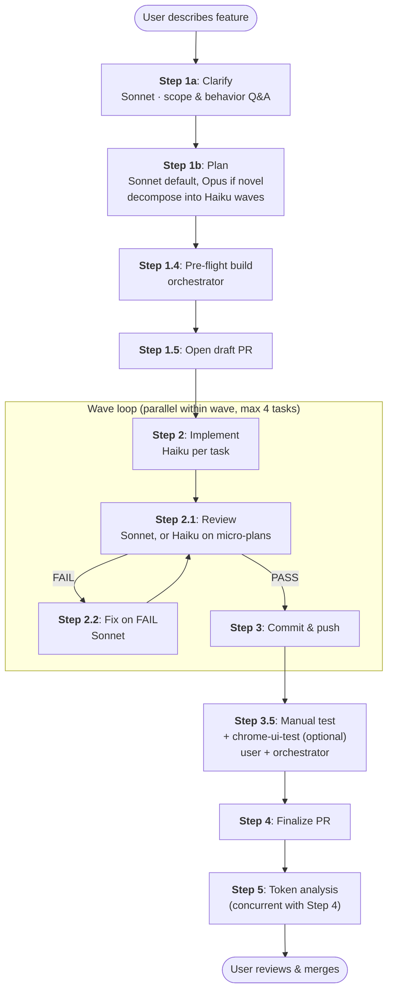

# Claude Code Pipeline

A general-purpose, tech-stack-agnostic orchestration pipeline for [Claude Code](https://docs.anthropic.com/en/docs/claude-code). Coordinates planning, implementation, code review, testing, and git workflow through specialized agents — across any language or framework.

## Why This Exists

Claude Code is powerful, but complex multi-file features benefit from structured coordination. Without it, you get:
- Implementations that drift from requirements
- Code that ships without review
- Regressions that slip through because tests weren't run
- Commits with inconsistent messages and no traceability

This pipeline enforces a disciplined workflow: **clarify → plan → implement → review → test → commit → manual verify → finalize → analyze token usage**. Every step is handled by a specialized agent with the right model (Haiku for mechanical tasks, Sonnet for judgment, Opus for architecture) — optimizing both quality and cost.

The pipeline is **tech-stack-agnostic**. The core workflow is identical whether you're building a Swift/iOS app, a React frontend, or a Python API. Stack-specific knowledge (build commands, code review rules, testing patterns) lives in **adapters** that get injected at runtime.

## Pipeline at a Glance



**Reading the diagram:** rectangular nodes are pipeline steps; the *Wave loop* subgraph executes once per dependency wave (typically 1–3 waves per feature). Steps 1a/1b are blocking on user approval; Step 3.5 is blocking on user manual testing. Step 5 runs in parallel with Step 4 to overlap analysis with PR finalization.

For the full step-by-step reference (every step, every model, every exit condition), see [docs/architecture.md](docs/architecture.md#pipeline-flow-details).

## Quick Start

### 1. Clone the pipeline into your project

```bash
cd your-project
git clone https://github.com/MILL5/claude-code-pipeline.git .claude/pipeline
```

Or add as a git submodule for version-pinned updates:

```bash
git submodule add https://github.com/MILL5/claude-code-pipeline.git .claude/pipeline
```

### 2. Bootstrap

```bash
# Auto-detect your tech stack
bash .claude/pipeline/init.sh .

# Or specify explicitly (supports multiple --stack flags for multi-stack repos)
bash .claude/pipeline/init.sh . --stack=react --stack=python --stack=bicep
```

The init script:
1. Detects all applicable tech stacks from project files (Package.swift, package.json, pyproject.toml, *.bicep, pubspec.yaml, build.gradle.kts, etc.)
2. Creates symlinks for `.claude/agents/`, `.claude/skills/`, and `.claude/scripts/<stack>/`
3. Writes `.claude/pipeline.config` with stacks, stack_paths, and pipeline path
4. Merges adapter hooks from all active adapters into `.claude/settings.json`
5. Generates `.claude/CLAUDE.md` and `.claude/ORCHESTRATOR.md` from templates
6. Creates `.claude/local/` with project-specific overlay templates

For per-stack details (required tooling, expected bootstrap output, common pitfalls), see the [adoption guides](#available-adapters) below.

### 3. Configure your project

Edit the generated files:

- **`.claude/CLAUDE.md`** — Set your developer persona, project description, workflow rules
- **`.claude/ORCHESTRATOR.md`** — Document your architecture, services, conventions, fragile areas
- **`.claude/local/`** — Add project-specific standards injected into agents (see [docs/configuration.md](docs/configuration.md))

### 4. Run the pipeline

Start Claude Code in your project directory:

```bash
claude
```

Then trigger the pipeline with `/orchestrate` or by describing your work in natural language ("implement X", "add feature X", "fix bug Y").

## Available Adapters

| Adapter | Auto-Detects | Build Tool | Test Framework | Coverage | Adoption Guide |
|---------|-------------|------------|----------------|----------|----------------|
| `swift-ios` | `*.xcodeproj`, `*.xcworkspace`, `Package.swift` | Xcode / Swift PM | XCTest | xccov | [swift-ios.md](docs/adoption/swift-ios.md) |
| `react` | `package.json` with `react` dependency | npm/yarn/pnpm/bun + tsc | Jest / Vitest | istanbul / v8 | [react.md](docs/adoption/react.md) |
| `python` | `pyproject.toml`, `setup.py`, `requirements.txt` | mypy + ruff | pytest | pytest-cov | [python.md](docs/adoption/python.md) |
| `flutter` | `pubspec.yaml` with `flutter:` | flutter analyze + dart format | flutter test (unit/widget/golden/integration) | lcov | [flutter.md](docs/adoption/flutter.md) |
| `android` | `build.gradle.kts`, `build.gradle` | Gradle (AGP) + Android lint | JUnit 4 + Robolectric / Espresso / Compose Testing | JaCoCo | [android.md](docs/adoption/android.md) |
| `bicep` | `*.bicep`, `bicepconfig.json` | bicep build + az bicep lint | ARM-TTK / PSRule / what-if | Resource validation coverage | [bicep.md](docs/adoption/bicep.md) |

Each adoption guide covers detection, required tools, bootstrap output, project layout assumptions, build/test commands, common pitfalls, and a worked first-`/orchestrate`-run example.

**Deploying to Azure?** See the **[Azure Deployment Guide](docs/azure-guide.md)** for the full Bicep + Azure SDK overlay + authentication + skills walkthrough.

**Adding a new adapter?** See [docs/contributing.md](docs/contributing.md) — needs 10 files following a documented contract, no edits to `init.sh` required.

## Documentation Map

| If you want to… | Read |
|---|---|
| Adopt the pipeline on a specific stack | [docs/adoption/](docs/adoption/) (one guide per adapter) |
| Understand agents, skills, and the overlay model | [docs/architecture.md](docs/architecture.md) |
| Do common workflows after bootstrap | [docs/how-to.md](docs/how-to.md) |
| Enable backlog integration (durable issue capture) | [docs/backlog-integration.md](docs/backlog-integration.md) |
| Customize `.claude/local/`, `pipeline.config`, hooks | [docs/configuration.md](docs/configuration.md) |
| Write a new adapter or run the test suite | [docs/contributing.md](docs/contributing.md) |
| Deploy with Bicep + Azure SDK | [docs/azure-guide.md](docs/azure-guide.md) |
| Set up structured defect reporting on PRs | [docs/testing-guide.md](docs/testing-guide.md) |

## Skills (compact reference)

The pipeline ships 18 skills. The most commonly used:

| Skill | Trigger | Purpose |
|-------|---------|---------|
| `orchestrate` | `/orchestrate` or describe work in natural language | Master pipeline coordinator |
| `build-runner` | `/build-runner`, "build" | Adapter build script |
| `test-runner` | `/test-runner`, "run tests" | Adapter test script with coverage |
| `open-pr` | `/open-pr` | Branch + draft PR |
| `fix-defects` | `/fix-defects` | Triage and fix defect reports from PR comments |
| `chrome-ui-test` | `/chrome-ui-test` (optional Step 3.5) | Browser UI smoke test (React UIs) |
| `bootstrap-backlog` | `/bootstrap-backlog` (one-time) | Provision backlog labels + Issue Forms |
| `update-pipeline` | `/update-pipeline` | Update pipeline submodule with validation |

Plus seven Azure-specific skills (`azure-login`, `validate-bicep`, `deploy-bicep`, `azure-cost-estimate`, `security-scan`, `infra-test-runner`, `azure-drift-check`) — see [docs/azure-guide.md](docs/azure-guide.md).

For the full skill list with detailed triggers, see [docs/architecture.md](docs/architecture.md#skills).

## Requirements

- [Claude Code](https://docs.anthropic.com/en/docs/claude-code) CLI (latest version)
- [GitHub CLI](https://cli.github.com/) (`gh`) — for PR management
- Python 3.8+ — for build/test runner scripts
- `jq` — for hook merging during init (optional but recommended)
- Stack-specific tools: see the [adoption guides](docs/adoption/) for each adapter

## FAQ

**Q: Can I use individual agents without the full pipeline?**
Yes. The agents work standalone. For example, launch `code-reviewer-agent` directly on your recent changes, or use `test-architect-agent` to generate tests for a specific file.

**Q: How do I add project-specific coding standards?**
Edit `.claude/local/coding-standards.md` with your rules. These get injected into the implementer and reviewer agents automatically. For architecture-level rules, use `architecture-rules.md`; for review-specific criteria, use `review-criteria.md`; for rules that apply to all agents, use `project-overlay.md`. See [docs/configuration.md](docs/configuration.md#claude-local).

**Q: How do I update the pipeline?**
Run `/update-pipeline` from Claude Code. It pulls the latest version, shows what changed, validates structural integrity, and commits the submodule bump. If validation fails, it offers to roll back. See [docs/how-to.md](docs/how-to.md#updating-the-pipeline).

**Q: What if my project uses multiple stacks?**
The pipeline supports multiple adapters simultaneously for multi-stack repos. Use `--stack=react --stack=python` with `init.sh`, or let auto-detection handle it. For Flutter apps with native platform code, use `--stack=flutter --stack=swift-ios --stack=android` — file-path routing sends Dart code to the Flutter overlay, Swift to swift-ios, and Kotlin to Android.

**Q: Does the pipeline support CI/CD integration?**
The pipeline runs locally via Claude Code. It creates PRs that your CI/CD system can pick up normally. The pipeline itself doesn't run in CI.

**Q: How do I update ORCHESTRATOR.md?**
The pipeline updates it automatically in Step 4 when architecture changes. You should also update it manually when making significant changes outside the pipeline, so the architect has accurate context.

**Q: What's the cost per feature?**
Varies by complexity. A typical 8-task feature (6 Haiku + 2 Sonnet) costs roughly $0.15–0.40 in API usage, compared to $0.90–2.00 if everything ran on Opus. The architect's plan includes a cost estimate before you approve.

## License

MIT — see [LICENSE](LICENSE).
