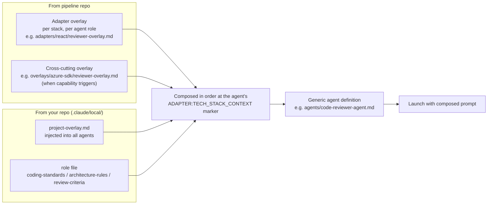

# Architecture

How the pipeline is structured: agents, skills, the reviewer protocol, the adapter overlay system, and the cost/token strategies.

For the visual summary of the pipeline flow, see the **[Pipeline at a Glance](../README.md#pipeline-at-a-glance)** Mermaid diagram in the README. The detailed step-by-step reference is at the end of this document under [Pipeline Flow Details](#pipeline-flow-details).

## Agents

The pipeline uses 4 specialized agents, each with a focused role:

| Agent | Default Model | Role |
|-------|--------------|------|
| `architect-agent` | Sonnet (1a), Sonnet/Opus (1b) | Feature clarification (1a) and implementation Q&A + plan generation (1b) |
| `implementer-agent` | Haiku | Executes individual tasks from context briefs. Escalates to Sonnet for fixes. |
| `code-reviewer-agent` | Sonnet | Aggressive code review with PASS/FAIL protocol |
| `test-architect-agent` | Haiku | Generates comprehensive test suites for coverage gaps |

Agents are **generic** — they contain no tech-stack-specific knowledge. Stack context is injected by the orchestrator at launch time via overlay markers (`<!-- ADAPTER:TECH_STACK_CONTEXT -->`).

## Skills

| Skill | Trigger | Purpose |
|-------|---------|---------|
| `orchestrate` | `/orchestrate`, "implement", "add feature", "fix bug" | Master pipeline coordinator |
| `architect-analyzer` | Step 1a (via orchestrator) | Feature-only clarification (scope, behavior, business rules) and enriched spec generation |
| `architect-planner` | Step 1b (via orchestrator) | Implementation Q&A then cost-optimized task decomposition into waves |
| `build-runner` | "build", "compile", "does it build" | Delegates to adapter's `build.py` script |
| `test-runner` | "run tests", "check tests", "validate" | Delegates to adapter's `test.py` script |
| `open-pr` | Step 1.5 (via orchestrator) or "open a PR" | Creates feature branch + draft PR |
| `summarize-implementation` | After implementation tasks | Generates conventional-commit messages |
| `token-analysis` | Step 5 (via orchestrator, mandatory) | Analyzes pipeline token usage, files GitHub issues for optimization findings |
| `fix-defects` | `/fix-defects`, "fix defects", "fix PR defects" | Reads defect reports from PR comments, triages by severity, runs fix pipeline |
| `chrome-ui-test` | Step 3.5 (when configured), `/chrome-ui-test` | Optional automated browser smoke test for React UIs; failures route into the standard bug-fix loop |
| `bootstrap-backlog` | `/bootstrap-backlog` (one-time per repo) | Provisions GitHub labels, Issue Form templates, and the sentinel config that enables backlog integration |
| `update-pipeline` | `/update-pipeline`, "update pipeline" | Updates pipeline submodule, validates, commits bump |
| `azure-login` | `/azure-login`, auto before Azure-dependent steps | Validates Azure auth, subscription context, RBAC permissions |
| `validate-bicep` | `/validate-bicep` | Bicep lint + build + optional what-if dry run |
| `deploy-bicep` | `/deploy-bicep` | Deploy Bicep to Azure with mandatory confirmation gate |
| `azure-cost-estimate` | `/azure-cost-estimate` | Estimate monthly Azure costs from Bicep templates |
| `security-scan` | `/security-scan` | PSRule/Checkov security and compliance scanning |
| `infra-test-runner` | `/infra-test-runner` | ARM-TTK/Pester infrastructure validation tests |
| `azure-drift-check` | `/azure-drift-check` | Detect config drift between templates and deployed state |

## Reviewer Tag Taxonomy

Step 2.1 reviews emit a `PASS` or `FAIL` header followed by an optional `--- OPTIONAL IMPROVEMENTS ---` section. Each entry in that section is prefixed with one of three tags so the orchestrator can route it deterministically:

| Tag | Meaning | Default routing |
|-----|---------|-----------------|
| `[should-fix]` | Real improvement, not a blocker. Tight duplication, missing abstraction, naming inconsistency the reviewer would raise again next time. | Fold candidate (subject to fold cap) |
| `[nice-to-have]` | Genuinely optional polish, speculative refactors, defensive code for unlikely cases. | Defer to backlog |
| `[simplify]` | Behavior-preserving rewrite for clarity, idiom, or concision. The reviewer must be confident the rewrite is observably equivalent — tests are the enforcement gate. | Fold by default; defer when emitted by a Haiku reviewer |

The combined cap across all three tags is 5 entries per review (forces explicit prioritization). When the spawned implementer for a `[simplify]` task fails the build/test gate, the simplification is **abandoned** rather than entering the standard fix loop — if tests fail, the rewrite is wrong by construction.

## Adapter Injection Flow

At runtime the orchestrator stitches a generic agent together with stack-specific knowledge before each launch:

```
Orchestrator reads .claude/pipeline.config
    |
    v
Loads adapters/<stack>/adapter.md (metadata)
    |
    v
For each agent launch:
    1. Read generic agent definition (agents/<name>.md)
    2. Resolve task stack from file paths via stack_paths.* patterns
    3. Read role overlay (adapters/<stack>/<role>-overlay.md)
       - Haiku implementers: use implementer-overlay-essential.md instead
    4. Append cross-cutting overlays (e.g., overlays/azure-sdk/<role>-overlay.md)
    5. Append .claude/local/ files for that role (per the matrix below)
    6. Insert composed text at the agent's <!-- ADAPTER:TECH_STACK_CONTEXT --> marker
    7. Pass composed prompt to Agent tool
```

The composition is layered — pipeline-wide content first, then project-specific overrides:



**Key consequences of this model:**

- **Multi-stack support:** when a task touches a React file, it gets React overlays; a Python file in the same wave gets Python overlays. The orchestrator resolves the stack per task using `stack_paths` patterns.
- **Capability-driven overlays:** cross-cutting overlays (e.g., `azure-sdk`) attach when adapter manifests declare matching capabilities — not by checking stack names. Adding a new adapter that declares `"capabilities": ["azure-auth"]` automatically pulls in the Azure overlay without editing pipeline code.
- **Two overlay variants per implementer:** the full `implementer-overlay.md` for Sonnet/Opus tasks, and a compact `implementer-overlay-essential.md` (≤1000 chars) for Haiku tasks to maximize signal-to-noise. The reviewer always uses the full overlay and catches what the essential variant elides.
- **Architect agents see all stacks:** for cross-stack design decisions; reviewer agents see the union of stacks present in the current wave's tasks.

This means:
- **Updating the pipeline** (`/update-pipeline` or git pull) immediately updates all projects using it
- **Switching stacks** only requires re-running `init.sh --stack=new-stack`
- **Custom overlays** can be added without modifying core pipeline files

## Local Overlays (Per-Project)

The `.claude/local/` directory holds project-specific standards that get composed into agents alongside adapter and cross-cutting overlays. These are committed to your repo, not the pipeline repo.

| File | Injected Into | Purpose |
|------|--------------|---------|
| `project-overlay.md` | All agents | Project-wide rules and conventions |
| `coding-standards.md` | Implementer + Reviewer | Code style beyond adapter defaults |
| `architecture-rules.md` | Architect | Architectural constraints and decisions |
| `review-criteria.md` | Reviewer | Team-specific review checklist |

**Composition order at injection markers:**

```
Adapter overlay (stack-specific, from pipeline)
  → Cross-cutting overlay (e.g., azure-sdk, from pipeline)
    → Local: project-overlay.md (all agents, from your repo)
      → Local: role-specific file (from your repo)
```

Local files are created by `init.sh` from templates. They are optional — empty files or files containing only template comments are skipped during injection.

## Cost Optimization

The pipeline is designed to minimize Claude API costs:

- **Haiku for mechanical tasks**: Single-file implementations with fully specified briefs (~$0.005-0.02 per task)
- **Sonnet for judgment**: Code review, design decisions, multi-file consistency (~$0.03-0.15 per task)
- **Opus for complex architecture**: Novel algorithm design, cross-cutting changes, security-critical planning (~$0.10-0.50 per task)
- **Sonnet-default planning**: Step 1b defaults to Sonnet; Opus reserved for novel architecture or cross-cutting complexity
- **Clean context windows**: Fresh agents for each pipeline step prevent context accumulation
- **File-based handoff**: Enriched spec written to disk between 1a and 1b (avoids carrying feature Q&A history into implementation planning)

A typical feature plan targets **>=70% Haiku tasks**, making the mixed strategy significantly cheaper than running everything on Sonnet or Opus.

## Token Optimization

The pipeline also reduces per-step token consumption through several strategies:

- **Scoped ORCHESTRATOR.md extracts**: Instead of pasting the full architecture file into every agent, the orchestrator extracts only the sections each agent needs. The 1b Extract excludes sections already present in the 1a-spec (Architecture, Key Services) to avoid duplication on the most expensive model.
- **Essential overlay variants**: Haiku implementers receive a compact rules-only overlay (~500-800 chars) instead of the full overlay with examples (~3,500 chars). The reviewer has the full overlay and catches violations.
- **Reviewer reuse via SendMessage**: Within a wave, one code-reviewer agent handles all reviews via SendMessage, avoiding re-ingestion of the agent definition and overlay per review (cap: 8 reviews per agent). Bug-fix reviews in Step 3.5 use the same reuse pattern.
- **Streaming wave reviews**: Reviews begin as each implementer completes, not after the full wave finishes. This overlaps review work with still-running tasks, reducing wall-clock time.
- **Parallel bug fixes**: Independent bugs (non-overlapping file sets) found during manual testing can be fixed in parallel using worktree isolation, same as Step 2 implementation.
- **Local overlay comment stripping**: HTML comment blocks are stripped from `.claude/local/` files before injection, so template placeholders don't waste tokens.
- **Background token analysis**: Step 5 runs concurrently with Step 4 (PR finalization) since it only needs the TOKEN_LEDGER, which is complete after Step 3.5.
- **TOKEN_REPORT protocol**: All agents append a `---TOKEN_REPORT---` block to their output, self-reporting files read from disk, tool calls, and token consumption. This captures the ~43% of token usage invisible to the orchestrator's prompt-level tracking.
- **Mandatory Step 5 analysis**: After every pipeline run, the token-analysis skill examines the accumulated ledger for cost anomalies, model distribution drift, prompt bloat, and escalation patterns — filing a GitHub issue on the pipeline repo when significant findings exist

## Pipeline Flow Details

The Mermaid summary in the README shows the high-level flow. Below is the detailed step-by-step reference with model annotations and exit conditions:

```
User: "Add feature X" or /orchestrate
    |
    v
Step 1a: FEATURE CLARIFICATION ──────────── architect-agent (Sonnet)
    |  Feature decomposition along product seams
    |  Fragile area scan against ORCHESTRATOR.md
    |  Feature-only Q&A: scope, behavior, business rules
    |    Soft-cap 2 SendMessage rounds; hard-cap 150K cumulative tokens
    |    User can type FINALIZE NOW to force closure
    |  NO technical/architecture questions — deferred to 1b
    |  Output: .claude/tmp/1a-spec.md (enriched spec)
    v
Step 1b: IMPL CLARIFICATION & PLAN ────── architect-agent (Sonnet default / Opus, fresh context)
    |  Reads enriched spec + 1b Extract from ORCHESTRATOR.md (~12K tokens clean)
    |  Phase 1: Implementation Q&A after codebase analysis (max 2 rounds)
    |    Architecture approach, patterns, integration, data modeling, tradeoffs
    |  Phase 2: Cost-optimized decomposition: >=70% Haiku tasks
    |  Self-contained context briefs per task
    |  Parallel waves with dependency ordering (cap 4 tasks per wave)
    |  Output: .claude/tmp/1b-plan.md (recovery artifact)
    |  User confirms plan before proceeding
    v
Step 1.4: PRE-FLIGHT BUILD VERIFICATION ── orchestrator
    |  Run adapter build script on the unmodified base before launching Haiku
    |  PASS  -> proceed to Step 1.5
    |  FAIL  -> pause; ask user: abort | continue anyway | inject Wave 0 fix
    |    Prevents Haiku failures from pre-existing build blockers
    v
Step 1.5: OPEN PR ────────────────────────── orchestrator
    |  Create feature branch from main
    |  Open draft PR with plan summary + task checklist
    v
Step 2: IMPLEMENT ────────────────────────── implementer-agent (Haiku/Sonnet/Opus)
    |  One agent per task, parallel within waves (cap 4)
    |  Each: implement -> self-review -> build -> test (>=90% coverage)
    |  Output: SUCCESS + commit message  OR  FAILURE + details
    v
Step 2.1: REVIEW ─────────────────────────── code-reviewer-agent (Sonnet, or Haiku on micro-plans)
    |  Aggressive review: memory leaks, race conditions, security, architecture
    |  Cost-proportional reviewer (M3): single-wave plans with all briefs <3KB
    |    use Haiku first-pass; Sonnet escalation on any FAIL
    |  Reviewer reuse via SendMessage (cap 8 reviews per agent)
    |  Output: PASS  OR  FAIL + structured issues list
    |          + OPTIONAL IMPROVEMENTS tagged [should-fix] / [nice-to-have] / [simplify]
    |            (combined cap 5 entries; orchestrator folds or defers per backlog rules)
    v
Step 2.2: FIX (if FAIL) ─────────────────── implementer-agent (Sonnet, escalated)
    |  Fix reviewer findings, re-build, re-test
    |  Max 2 review-fix cycles, then escalate to user
    v
Step 3: COMMIT + PUSH ───────────────────── orchestrator
    |  Commit per task with implementer's message verbatim
    |  Push after each commit (progress visible on draft PR)
    |  Record test baseline (total passing count)
    v
Step 3.5: MANUAL TEST + BROWSER UI ──────── user + orchestrator + chrome-ui-test (optional)
    |  Optional automated browser smoke via the chrome-ui-test skill (React UIs)
    |    Failures route into the same fix loop as user-reported bugs
    |  User tests the PR branch, reports bugs
    |  Each bug: assess blast radius -> fix -> review -> commit
    |  Regression guard: test count must never decrease
    |  Max 3 fix cycles per round, then escalate
    v
Step 4: FINALIZE ─────────────────────────── orchestrator
    |  Update ORCHESTRATOR.md if architecture changed
    |  Update PR body with coverage numbers
    |  Mark PR ready for review
    |  Report: PR URL, tasks completed, coverage summary
    v
Step 5: TOKEN ANALYSIS ──────────────────── token-analysis skill (mandatory)
    |  Analyze TOKEN_LEDGER: cost, model distribution, prompt efficiency
    |  File GitHub issue on pipeline repo if significant findings
    v
User merges when ready (pipeline never auto-merges)
```
