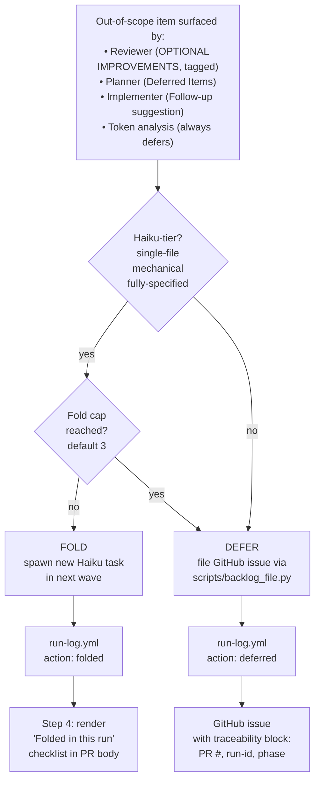

# Backlog Integration

Backlog integration captures out-of-scope work surfaced during `/orchestrate` runs — reviewer nice-to-haves, architect scope cuts, token-analysis findings — as durable GitHub issues with a namespaced label taxonomy. Small, Haiku-tier items fold into the current run; anything larger defers to the backlog.

## Fold vs. defer at a glance



The fold cap is shared across all phases (planner + reviewer + implementer + token-analysis combined), preventing reviewer and planner from collectively turning into a second round of implementation work. `[simplify]`-tagged reviewer entries fold by default but defer when emitted by a Haiku reviewer (an extra safety guard — Haiku judgment on behavior preservation isn't yet trusted enough for in-run auto-apply).

## Prerequisites

- `gh` CLI installed and authenticated (`gh auth status` exit 0).
- A GitHub remote configured (`git remote get-url origin` succeeds).
- Write access to labels on the remote's owner.

## One-time setup

Run the bootstrap skill from inside your project:

```
/bootstrap-backlog
```

This does three things:

1. **Creates 12 namespaced labels** on your GitHub repo via `gh label create --force`:
   `type: {bug,feature,chore,docs}`, `priority: {p0,p1,p2}`,
   `status: {needs-triage,blocked,ready}`, `source: ai-deferred`, plus the
   GitHub specials `good first issue` and `help wanted`.
2. **Copies four Issue Form YAMLs** into `.github/ISSUE_TEMPLATE/`:
   `bug_report.yml`, `feature_request.yml`, `chore.yml`, `config.yml` (the
   last disables blank issues to force template use).
3. **Writes the sentinel config** `.github/pipeline-backlog.yml` with defaults
   (`enabled: true`, `fold_cap: 3`, `project_number: null`). This file is the
   opt-in signal — its presence enables filing; deleting it disables.

**Expected output:**

```
bootstrap-backlog: complete
  Labels provisioned:   12 (via gh label create --force)
  Issue Forms:          .github/ISSUE_TEMPLATE/{bug_report,feature_request,chore,config}.yml
  Sentinel config:      .github/pipeline-backlog.yml (created)

Next steps:
  1. Review .github/ISSUE_TEMPLATE/ and .github/pipeline-backlog.yml
  2. Commit and push — backlog integration activates on the next /orchestrate run
```

## Verify

```bash
gh label list                                 # 12+ labels listed
ls .github/ISSUE_TEMPLATE/                    # 4 YAML files
cat .github/pipeline-backlog.yml              # version: 1, enabled: true, fold_cap: 3
```

Open a test issue in the GitHub UI and confirm templates render and labels auto-apply.

## How filing behaves during /orchestrate runs

- **Haiku-tier surfaced items** fold into the current run as new implementer tasks, up to the `fold_cap` limit (default 3 per run). They show up in the "Folded in this run" checklist in the PR description.
- **Sonnet/Opus-tier items** file as GitHub issues using the `chore.yml` template, labeled `type: chore`, `priority: p2`, `source: ai-deferred`. Each issue body includes a traceability block: originating PR number, phase (planner, reviewer, implementer, token-analysis), run ID, and one-line reasoning.
- **If the sentinel is absent** when `/orchestrate` runs, filing is skipped silently with one hint line (`backlog integration not enabled for this repo — run /bootstrap-backlog to enable`). The pipeline otherwise runs normally.

## Customization

Edit `.github/pipeline-backlog.yml` to tune behavior:

```yaml
version: 1
enabled: true        # set false to disable without deleting
fold_cap: 3          # 0 = never fold, always defer; 5 = allow more folds
project_number: 7    # optional GitHub Projects v2 number; filed issues auto-added
```

## Disable

Delete `.github/pipeline-backlog.yml`. Labels and Issue Form templates remain (they're harmless additive provisioning). Future `/orchestrate` runs will log the skip hint but continue normally.

## Re-running is safe

`/bootstrap-backlog` is idempotent. `gh label create --force` updates existing labels (note: this overwrites color/description on same-name labels — if your repo has pre-existing `type: bug` with a different color, it will be updated). Issue Form YAMLs are refreshed from the pipeline source of truth. The sentinel config is **NOT overwritten** if present, so your customizations to `fold_cap` or `project_number` survive a re-run.

Re-run after `/update-pipeline` to pick up any label or template changes.
